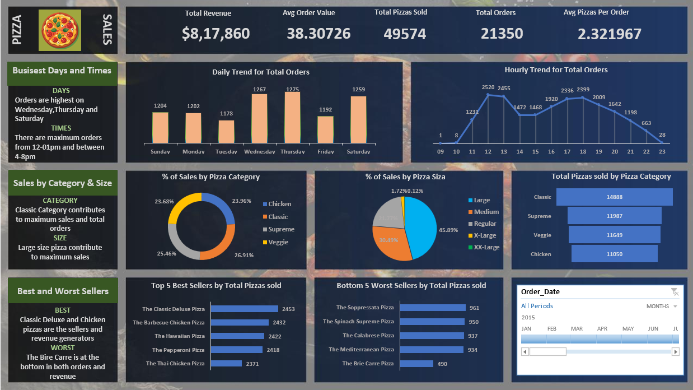

# Sales_Analysis

## 📌 Overview
This project demonstrates an end-to-end data analytics workflow to solve business problems using SQL and Excel. The analysis starts with importing CSV data into a SQL database, running analytical queries, documenting insights, and finally building an interactive Excel dashboard using pivot tables and charts.

The project highlights practical skills in SQL analysis, data cleaning, and business-focused dashboarding.

---

## 📊 Dataset

The primary analysis file for this project is:
- [Sales_analysis.xlsx](Sales_analysis.xlsx)

This Excel workbook is connected to a MySQL Server database and contains cleaned, analysis-ready data used to create:
- Pivot tables  
- Charts  
- An interactive dashboard  

The underlying data is originally sourced from CSV files that are ingested into the database.

---

## 🛠️ Tools & Technologies
- **MySQL Server** – Data storage and querying  
- **SQL** – Business problem solving and analysis  
- **Excel** – Data cleaning, pivot tables, charts, dashboard  
- **CSV Files** – Raw input data  
- **GitHub** – Version control and documentation  

---

## 🔄 Project Workflow
1. Import CSV files into MySQL Server  
2. Write SQL queries to answer business questions  
3. Document all queries and results in a report  
4. Connect Excel to the MySQL Server database  
5. Clean and transform data in Excel  
6. Create pivot tables and charts  
7. Build an interactive dashboard using Excel  

---

## 📈 Dashboard
The Excel dashboard provides:
- Interactive pivot tables  
- Business-focused charts and KPIs  
- Filters and slicers for dynamic analysis

**Dashboard Preview:**  

---

## 📌 Key Results & Insights
- Business questions answered using SQL queries  
- Clean and structured data prepared for analysis  
- Interactive dashboard enabling quick decision-making  

---

## ▶️ How to Run
1. Import the CSV files into MySQL Server  
2. Execute the SQL queries provided in the project report  
3. Open **Sales_analysis.xlsx**  
4. Refresh the database connection in Excel  
5. Interact with pivot tables and dashboard visuals  

---

## 📜 License
This project is licensed under the MIT License.
